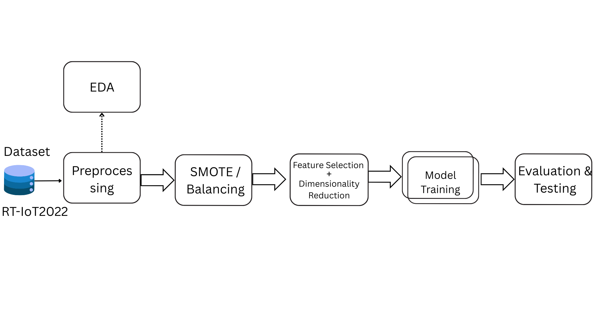

# Cải Thiện Hiệu Suất Phát Hiện Xâm Nhập Thông Qua Lựa Chọn Đặc Trưng và So Sánh Mô Hình trên Dữ Liệu RT-IoT2022

## Tổng Quan
Dự án này tập trung vào việc nâng cao hiệu suất của hệ thống phát hiện xâm nhập bằng cách sử dụng tập dữ liệu RT-IoT2022. Nghiên cứu nhằm cải thiện độ chính xác và hiệu quả tính toán thông qua việc áp dụng các kỹ thuật lựa chọn đặc trưng và so sánh các mô hình học máy khác nhau. Tập dữ liệu RT-IoT2022, được thu thập từ cơ sở hạ tầng IoT thời gian thực, bao gồm các hành vi mạng đa dạng và các kịch bản tấn công phức tạp, là nguồn tài nguyên lý tưởng để nghiên cứu lựa chọn đặc trưng và tối ưu hóa mô hình.

## Mục Tiêu
- **Lựa Chọn Đặc Trưng**: Xác định và giảm số lượng đặc trưng từ 85 xuống khoảng 40 bằng các phương pháp như Feature Importance và ngưỡng tương quan (>0.8) để loại bỏ các đặc trưng không liên quan hoặc dư thừa.
- **So Sánh Mô Hình**: Huấn luyện và đánh giá nhiều mô hình học máy (SVM, LinearSVC, XGBoost, Logistic Regression, KNN, Random Forest, Neural Network) để xác định mô hình hiệu quả nhất cho việc phát hiện xâm nhập thời gian thực.
- **Đánh Giá Hiệu Suất**: Đánh giá hiệu suất mô hình bằng các chỉ số như Accuracy, F1-Score, Precision và Recall, so sánh kết quả trước và sau khi lựa chọn đặc trưng.
- **Tiền Xử Lý Dữ Liệu**: Sử dụng SMOTE để cân bằng lớp và StandardScaler để chuẩn hóa dữ liệu, đảm bảo quá trình huấn luyện mô hình ổn định.

## Tập Dữ Liệu
Tập dữ liệu RT-IoT2022 là một bộ dữ liệu IoT toàn diện bao gồm:
- Hành vi mạng bình thường và bất thường.
- Dữ liệu từ các thiết bị IoT như ThingSpeak-LED, Wipro-Bulb và MQTT-Temp.
- Các kịch bản tấn công mô phỏng như Brute-Force SSH, DDoS (Hping, Slowloris) và thăm dò Nmap.
- Các thuộc tính lưu lượng mạng được ghi lại bằng công cụ Zeek và plugin Flowmeter.


**Phân bố nhãn trong "Attack_type"**:
<div style="text-align: center;">
    
</div>

**Tỷ lệ dữ liệu bình thường và tấn công**:
<div style="text-align: center;">
    
</div>

**Đặc trưng của tập dữ liệu RT-IoT2022**:
<div style="text-align: center;">
    
</div>

**Nguồn**: [RT-IoT2022, UCI Machine Learning Repository](https://doi.org/10.24432/C5P338)

## Phương Pháp Nghiên Cứu
Nghiên cứu kết hợp phân tích lý thuyết, triển khai thực nghiệm và tham vấn chuyên gia để đạt được các mục tiêu đề ra.

### 1. Phân Tích Lý Thuyết
- Tìm hiểu tài liệu liên quan đến tập dữ liệu RT-IoT2022, các phương pháp lựa chọn đặc trưng (Feature Importance, ngưỡng tương quan) và mô hình học máy.
- Nghiên cứu các thư viện như scikit-learn, TensorFlow và PyTorch để triển khai mô hình.
- Tham khảo các nguồn đáng tin cậy từ IEEE Xplore, SpringerLink và các hội nghị bảo mật (USENIX Security, NDSS).

### 2. Triển Khai Thực Nghiệm

<div style="text-align: center;">
    
</div>

- **Tiền Xử Lý Dữ Liệu**:
  - Áp dụng SMOTE để xử lý mất cân bằng lớp.
  - Sử dụng StandardScaler để chuẩn hóa dữ liệu.
- **Lựa Chọn Đặc Trưng**:
  - Áp dụng Feature Importance và ngưỡng tương quan (>0.8) để giảm số đặc trưng từ 85 xuống khoảng 40.
- **Huấn Luyện Mô Hình**:
  - Huấn luyện các mô hình (SVM, LinearSVC, XGBoost, Logistic Regression, KNN, Random Forest, Neural Network) bằng scikit-learn và TensorFlow/PyTorch.
  - Chia dữ liệu: 80% huấn luyện, 20% kiểm tra, sử dụng xác thực chéo 5-fold.
  <div style="text-align: center;">
        
    </div>
- **Đánh Giá Hiệu Suất**:
  - Đo lường hiệu suất bằng Accuracy, Precision, Recall và F1-Score.
  - So sánh hiệu suất trước và sau khi lựa chọn đặc trưng bằng đường cong ROC và các chỉ số thống kê.
  - Phân tích thời gian xử lý để đánh giá hiệu quả tính toán.

### 3. Tham Vấn Chuyên Gia
- Thảo luận thường xuyên với giảng viên hướng dẫn (TS. Đỗ Như Tài) để làm rõ các vấn đề khoa học và đảm bảo tiến độ nghiên cứu.
- Điều chỉnh chiến lược thực nghiệm dựa trên ý kiến chuyên gia.

## Giả Thuyết Khoa Học
Việc áp dụng các phương pháp lựa chọn đặc trưng (Feature Importance và ngưỡng tương quan) sẽ cải thiện Accuracy, F1-Score, Precision, Recall và thời gian xử lý của các mô hình học máy trong việc phát hiện tấn công mạng trên tập dữ liệu RT-IoT2022.

## Đóng Góp Dự Kiến
- Chứng minh hiệu quả của SMOTE trong xử lý mất cân bằng lớp trên tập dữ liệu IoT.
- Xác định các đặc trưng quan trọng cho việc phát hiện xâm nhập bằng Feature Importance và ngưỡng tương quan.
- Cung cấp phân tích so sánh các mô hình học máy để định hướng lựa chọn mô hình cho các ứng dụng bảo mật IoT thời gian thực.
- Nâng cao độ chính xác và hiệu quả tính toán cho việc phát hiện các cuộc tấn công như DDoS và Brute-Force trong hệ thống IoT.

## Tiến Độ Dự Án
| STT | Nội Dung | Thời Gian Dự Kiến | Ngày Hoàn Thành Dự Kiến |
|-----|----------|-------------------|-------------------------|
| 1   | Nghiên cứu, chọn đề tài, xây dựng đề cương luận văn | 2 tuần | Hoàn thành |
| 2   | Nộp đề cương, chỉnh sửa và hoàn thiện đề cương | 1 tuần | Hoàn thành |
| 3   | Viết và hoàn thiện luận văn (Tóm tắt, Chương 1-5, Tài liệu tham khảo) | 1 tuần | Hoàn thành |

## Hướng Dẫn Cài Đặt

Hướng dẫn thiết lập môi trường dự án, bao gồm Python, scikit-learn, TensorFlow, PyTorch và các thư viện phụ thuộc khác.

### Yêu cầu
- **Python**: Phiên bản 3.10

### Các bước cài đặt

1. **Tạo và kích hoạt môi trường ảo**:
  ```bash
  python -m venv venv
  source venv/bin/activate  # Trên macOS/Linux
  venv\Scripts\activate     # Trên Windows
  ```
2. **Cài đặt các thư viện cần thiết**:
  ```bash
    pip install -r requirements.txt
  ```
3. **Tải mã nguồn dự án**:
  ```bash
  git clone https://github.com/quixinh/ppnckh.git
  cd ppnckh
  ```

## Kết Quả
[Chưa xác định: Tóm tắt kết quả thực nghiệm, bao gồm các chỉ số hiệu suất (Accuracy, F1-Score, Precision, Recall) và so sánh trước/sau khi lựa chọn đặc trưng.]
## So Sánh Hiệu Suất Các Mô Hình Phân Loại Với Dữ Liệu Chưa Giảm Chiếu

### Bảng 2: Hiệu suất các mô hình phân loại với dữ liệu chưa giảm chiếu


| Mô hình           | Accuracy | Precision | Recall | F1-score | Thời gian (s) |
|-------------------|----------|-----------|--------|----------|---------------|
| LinearSVC         | 0.986    | 0.812     | 0.904  | 0.840    | 894.8840      |
| XGBoost           | 0.998    | 0.956     | 0.952  | 0.954    | 3.9874        |
| Logistic Regression | 0.983  | 0.794     | 0.921  | 0.825    | 22.2761       |
| KNN               | 0.996    | 0.896     | 0.943  | 0.912    | 0.0390        |
| Random Forest     | 0.997    | 0.981     | 0.947  | 0.961    | 5.7090        |
| MLP               | 0.978    | 0.774     | 0.914  | 0.808    | 108.430       |

### Bảng 3: Hiệu suất các mô hình phân loại với dữ liệu đã giảm chiếu

| Mô hình           | Accuracy | Precision | Recall | F1-score | Thời gian (s) |
|-------------------|----------|-----------|--------|----------|---------------|
| LinearSVC         | 0.945    | 0.708     | 0.804  | 0.724    | 79.1720       |
| XGBoost           | 0.998    | 0.982     | 0.952  | 0.964    | 1.7791        |
| Logistic Regression | 0.963  | 0.710     | 0.886  | 0.748    | 18.55590      |
| KNN               | 0.996    | 0.935     | 0.942  | 0.929    | 0.0140        |
| Random Forest     | 0.997    | 0.978     | 0.947  | 0.960    | 3.5242        |
| MLP               | 0.980    | 0.757     | 0.914  | 0.790    | 102.1000      |

### Bảng 4: Hiệu suất mô hình sử dụng RandomizedSearchCV

| Mô hình           | Accuracy | Precision | Recall | F1-score | Thời gian (s) |
|-------------------|----------|-----------|--------|----------|---------------|
| XGBoost (subsample=0.8, scale_pos_weight=1.0, n_estimators=100, max_depth=3, learning_rate=0.2, gamma=0.1, colsample_bytree=0.6) | 0.997 | 0.969 | 0.936 | 0.950 | 344.29 |
| KNN (weights='distance', n_neighbors=3, metric='manhattan') | 0.997 | 0.908 | 0.943 | 0.920 | 154.19 |
| Random Forest (bootstrap=False, max_depth=14, max_features='sqrt', min_samples_leaf=1, min_samples_split=4, n_estimators=108) | 0.998 | 0.952 | 0.950 | 0.951 | 250.52 |

### Bảng 5: Hiệu suất mô hình sử dụng GridSearchCV

| Mô hình           | Accuracy | Precision | Recall | F1-score | Thời gian (s) |
|-------------------|----------|-----------|--------|----------|---------------|
| XGBoost (colsample_bytree=0.6, gamma=0, learning_rate=0.2, max_depth=5, n_estimators=100, scale_pos_weight=1.0, subsample=0.8) | 0.998 | 0.980 | 0.938 | 0.956 | 12596.003 |
| KNN (metric='manhattan', n_neighbors=3, weights='distance') | 0.997 | 0.908 | 0.943 | 0.920 | 204.72 |
| Random Forest (bootstrap=False, max_depth=20, max_features='sqrt', min_samples_leaf=1, min_samples_split=5, n_estimators=200) | 0.998 | 0.980 | 0.950 | 0.962 | 4597.30 |

## Cấu Trúc Thư Mục
[Chưa xác định: Mô tả cấu trúc thư mục của dự án, ví dụ: mã nguồn, dữ liệu, mô hình và đầu ra.]

## Tài Liệu Tham Khảo
1. S. Bhunia and R. Nagapadma. RT-IoT2022. UCI Machine Learning Repository, 2023. https://doi.org/10.24432/C5P338.
2. [Chưa xác định: Các tài liệu tham khảo bổ sung từ IEEE Xplore, SpringerLink hoặc các nguồn khác.]


## Liên Hệ
- **Sinh Viên**: Tạ Hồng Quí
- **Mã Số Sinh Viên**: 3122410348
- **Giảng Viên Hướng Dẫn**: TS. Đỗ Như Tài
- **Cơ Quan**: Trường Đại học Sài Gòn, Khoa Công nghệ Thông tin
- **Email**: thqui68@gmail.com